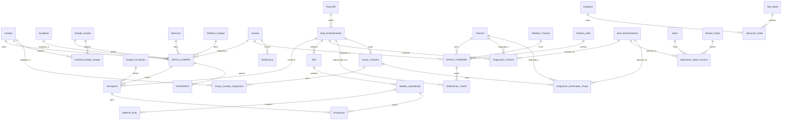

# Diagrama de base de datos CAMPUSLANDS

```mermaid

erDiagram
    Camper ||--o{ DATOS_CAMPER : tiene
    Camper ||--o{ Historial_estado_camper : registra
    Acudiente ||--o{ DATOS_CAMPER : asignado_a
    Estado_camper ||--o{ DATOS_CAMPER : define
    Estado_camper ||--o{ Historial_estado_camper : registra
    Direccion ||--o{ DATOS_CAMPER : tiene
    Telefono_Camper ||--o{ DATOS_CAMPER : tiene
    Usuario ||--o{ DATOS_CAMPER : asignado_a
    
    DATOS_CAMPER ||--o{ Inscripcion : realiza
    Ruta_Entrenamiento ||--o{ Inscripcion : contiene
    Estado_Inscripcion ||--o{ Inscripcion : define
    
    Ruta_BD ||--o{ Ruta_Entrenamiento : define
    Ruta_Entrenamiento ||--o{ Skill : contiene
    Skill ||--o{ Modulo_Aprendizaje : contiene
    Modulo_Aprendizaje ||--o{ Material_Ruta : contiene
    
    Inscripcion ||--o{ Evaluacion : tiene
    Modulo_Aprendizaje ||--o{ Evaluacion : evalua
    
    Trainner ||--o{ DATOS_TRAINNER : tiene
    Trainner ||--o{ Asignacion_Trainner : asignado_a
    Telefono_Trainner ||--o{ DATOS_TRAINNER : tiene
    Usuario ||--o{ DATOS_TRAINNER : asignado_a
    Trainers_skills ||--o{ DATOS_TRAINNER : certifica
    
    Ruta_Entrenamiento ||--o{ Asignacion_Trainner : contiene
    Area_Entrenamiento ||--o{ Asignacion_Trainner : ubicada_en
    
    Salon ||--o{ Asignacion_Salon_Horario : tiene
    Horario_Clase ||--o{ Asignacion_Salon_Horario : define
    Area_Entrenamiento ||--o{ Asignacion_Salon_Horario : ubicada_en
    
    Usuario ||--o{ Notificacion : recibe
    DATOS_TRAINNER ||--o{ Notificacion_Trainer : recibe
    Ruta_Entrenamiento ||--o{ Notificacion_Trainer : relacionada_con
    
    Ruta_Entrenamiento ||--o{ Grupo_Campers : sigue
    Grupo_Campers ||--o{ Grupo_Camper_Asignacion : tiene
    Camper ||--o{ Grupo_Camper_Asignacion : asignado_a
    
    Trainner ||--o{ Asignacion_Entrenador_Grupo : asignado_a
    Grupo_Campers ||--o{ Asignacion_Entrenador_Grupo : tiene
    Area_Entrenamiento ||--o{ Asignacion_Entrenador_Grupo : ubicada_en
    
    DATOS_CAMPER ||--o{ EGRESADO : gradua
    
    Empresa ||--o{ Ubicacion_Sede : tiene
    Tipo_Sede ||--o{ Ubicacion_Sede : clasifica

```